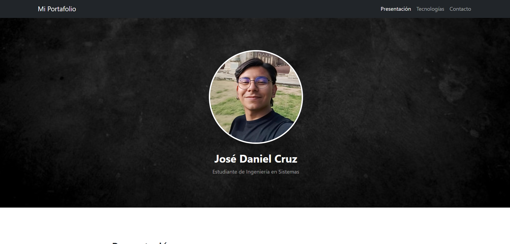
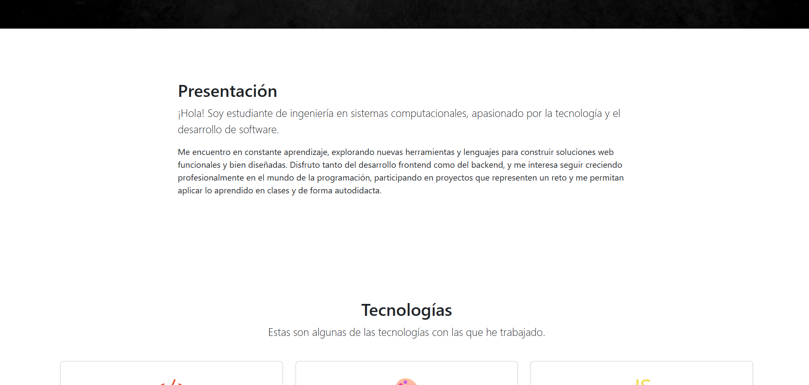
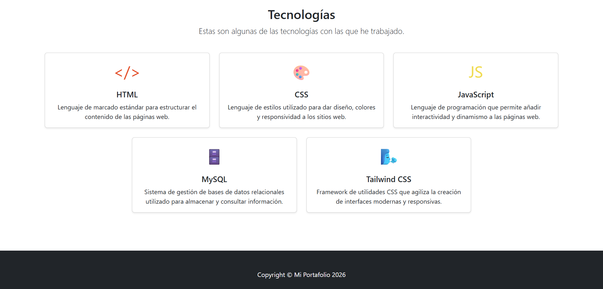
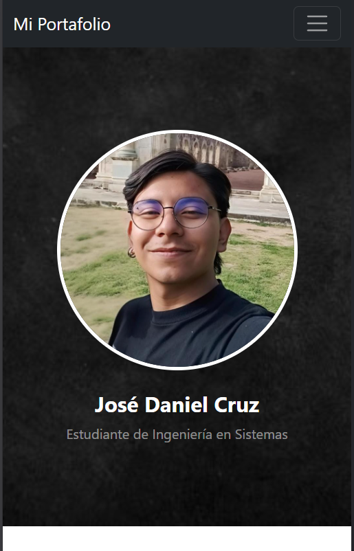
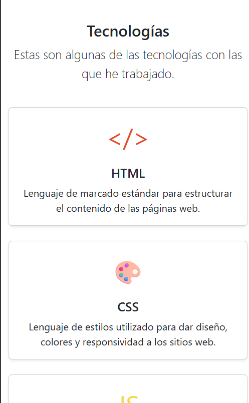

# Portafolio Web - Estudiante de Ingeniería en Sistemas

**Nombre del proyecto:** Portafolio Personal
**Descripción breve:** Sitio web tipo landing page que presenta mi perfil como estudiante de Ingeniería en Sistemas, mostrando quién soy y las tecnologías con las que trabajo. Está construido a partir de una plantilla de Bootstrap y publicado en GitHub Pages.

---

## Descripción del proyecto

- **Framework CSS utilizado:** El sitio está construido sobre **Bootstrap 5**, el cual viene incluido en el archivo `css/styles.css` de la plantilla original. No se utilizó Tailwind para el maquetado del sitio (aunque sí se menciona como una de las tecnologías que conozco dentro del contenido de la página).
- **Plantilla utilizada:** [Full Width Pics](https://startbootstrap.com/template/full-width-pics), una plantilla gratuita de [StartBootstrap](https://startbootstrap.com/) pensada originalmente como landing page con imágenes de fondo a ancho completo.
- **Secciones que componen el portafolio:**
  * **Navbar (menú de navegación):** Barra superior fija con enlaces directos a las secciones de Presentación, Tecnologías y Contacto.
  * **Encabezado / Header:** Imagen de fondo a pantalla completa con foto de perfil circular ampliada, mi nombre y el título "Estudiante de Ingeniería en Sistemas".
  * **Presentación:** Sección con una breve descripción personal, contando quién soy, mis intereses dentro de la carrera y mi motivación por seguir aprendiendo.
  * **Imagen decorativa de fondo:** Sección intermedia con una segunda imagen a ancho completo, heredada de la plantilla original, que separa visualmente la presentación de las tecnologías.
  * **Tecnologías:** Conjunto de tarjetas (cards) que muestran las herramientas con las que he trabajado: HTML, CSS, JavaScript, MySQL y Tailwind CSS, cada una con una breve descripción de para qué sirve.
  * **Footer:** Pie de página con los créditos y el año.

---

## Proceso de creación

1. **Selección de la plantilla:** Se eligió *Full Width Pics* de StartBootstrap por su diseño simple, con imágenes grandes de fondo, ideal para adaptarla a un portafolio personal.
2. **Descarga y exploración de archivos:** Se descargó el proyecto en su versión GitHub Pages, revisando la estructura (`index.html`, `css/styles.css`, `js/scripts.js`, `assets/`) para entender qué elementos se podían modificar sin romper el diseño base.
3. **Ajuste de la imagen de perfil:** La foto circular del encabezado se aumentó de tamaño (de 150x150 a 280x280 px) y se le agregó un borde blanco, para que tuviera más presencia visual dentro del header.
4. **Reemplazo del contenido de texto:** Se cambiaron los textos genéricos de la plantilla por contenido propio, adaptando el encabezado, el menú de navegación y el título de la página.
5. **Creación de la sección de Presentación:** Se reutilizó la primera sección de contenido de la plantilla, cambiando el texto por una presentación personal como estudiante de Ingeniería en Sistemas.
6. **Creación de la sección de Tecnologías:** Se transformó la segunda sección de contenido en una cuadrícula de tarjetas (usando el componente `card` de Bootstrap), una por cada tecnología (HTML, CSS, JavaScript, MySQL y Tailwind CSS), con un ícono/emoji representativo y una breve descripción de cada una.
7. **Ajustes menores:** Se actualizó el nombre de la marca en el navbar, los enlaces del menú (para que apunten a las secciones con anclas `#presentacion` y `#tecnologias`) y el texto del footer.
8. **Publicación:** El proyecto se subió a un repositorio público de GitHub y se activó GitHub Pages para poder visualizar el portafolio en línea.

---

## Capturas de pantalla

### Vista de escritorio

### Vista responsiva / móvil

---

## Enlaces

- **Plantilla original:** [Full Width Pics - StartBootstrap](https://startbootstrap.com/template/full-width-pics)
- **Repositorio en GitHub:** _(agregar enlace del repositorio)_
- **GitHub Pages (portafolio en vivo):** _(agregar enlace una vez publicado)_
